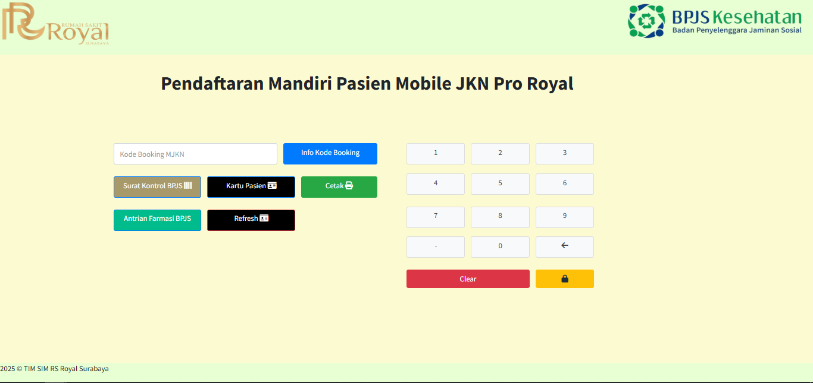

# ROYAL PRO

Royal Pro merupakan aplikasi custom yang buatkan untuk kebutuhan tambahan yang digitalisasi

Aplikasi dan fitur-fitur yang saya ikut berkontribusi 

## Tanda Tangan Farmasi

Aplikasi tanda tangan farmasi ini dibuat bertujuan untuk membantu pihak farmasi mengurangi penggunaan kertas tracer saat mencetak resep obat.

### Cara Kerja Aplikasi Tanda Tangan Farmasi
- Petugas akan mencari data pasien berdasarkan kunjungan terakhir pasien menggunakan Nomor Rekam Medis yang telah tercatat dalam sistem RS
- Dalam proses pencarian, sistem akan mengecek apakah pasien tersebut sudah melakukan tanda tangan digital atau tidak.
- Jika pasien tersebut belum melakukan tanda tangan digital, maka pasien diarahkan untuk melakukan tanda tangan digital
- Jika pasien tersebut telah melakukan tanda tangan digital, maka pasien akan diminta untuk konfirmasi tanda tangan digital yang sudah terekam sistem 
- Setelah selesai tanda tangan, pihak farmasi dapat menunjukan obat apa saja yang telah di order dan terdapat barcode dari dokter yang order obat dan tanda tangan pasien sebelumnya.
- Jika telah sesuai, maka pihak farmasi akan melakukan simpan data ke database.  

### Fitur Aplikasi Tanda Tangan Farmasi
- Fitur Cari untuk mencari data pasien dan tanda tangan digital pasien 
- Fitur Refresh untuk refresh halaman tanda tangan digital
- Fitur Lihat Resep untuk melihat resep yang telah di orderkan dokter untuk pasien tersebut 
- Fitur tanda tangan dimana terdapat canvas untuk tanda tangan, fitur hapus untuk menghapus tanda tangan jika salah, fitur simpan gambar untuk simpan hasil ttd ke database 

### TEKNOLOGI YANG DIGUNAKAN

- Codeigniter 3.1.13
- SQL Server
- jQuery
- Javascript
- Bootstrap

### Tampilan Aplikasi Tanda Tangan Farmasi

### TAMPILAN AWAL TANDA TANGAN FARMASI

### TAMPILAN PENCARIAN DATA PASIEN

 

### TAMPILAN CANVAS TANDA TANGAN PASIEN

 

### TAMPILAN LIHAT RESEP OBAT

 
 

### TAMPILAN HASIL TANDA TANGAN PASIEN
 

## MJKN PRO (Mobile JKN)
Aplikasi MJKN PRO merupakan aplikasi APM (Anjungan Pendaftaran Mandiri) untuk mempermudah dan mempersingkat waktu pasien dalam melakukan pendaftaran ke poli

### Kontribusi Saya pada Fitur Aplikasi MJKN PRO 
- Surat Kontrol BPJS untuk melakukan edit surat kontrol pada pasien yang kontrol terlambat (mundur) dari tanggal yang telah di tentukan dan mengganti dokter berdasarkan kondisi tertentu contohnya dokter tersebut cuti mendadak. 

### Cara Kerja Aplikasi MJKN PRO
- Terdapat dua jenis surat kontrol yang bisa digunakan pada aplikasi ini yaitu Surat Kontrol Berbarcode dan Surat Kontrol yang memiliki keterangan "Surat Kontrol sudah di terbitkan ditanggal yang sama"
- Jika Surat Kontrol Berbarcode maka Petugas APM akan memasukan nomor surat kontrol kemudian klik via no surat kontrol maka akan tampil informasi surat kontrol seperti nama dokter, nama poli dan tanggal kontrol. Petugas APM menggantikan tanggal kontrol untuk tanggal yang dilakukan kontrol kemudian simpan. 
- Jika Surat Kontrol memiliki keterangan "Surat Kontrol sudah diterbitkan ditanggal yang sama" maka Petugas APM memasukan nomor kartu BPJS pasien kemudian memilih bulan dan tahun sesuai dengan kedatangan pasien pada saat itu atau berpatokan pada surat kontrol tersebut di rencakan. Tampilannya akan sama seperti via no surat kontrol.
- Jika berhasil melakukan perubahan maka pasien bisa di arahkan untuk melakukan pendaftaran.

### Tampilan Aplikasi MJKN PRO

### TAMPILAN AWAL MJKN PRO

### TAMPILAN SURAT KONTROL BPJS

 

### TEKNOLOGI YANG DIGUNAKAN

- Codeigniter 3.1.13
- SQL Server
- MySQL
- jQuery
- Javascript
- Bootstrap
